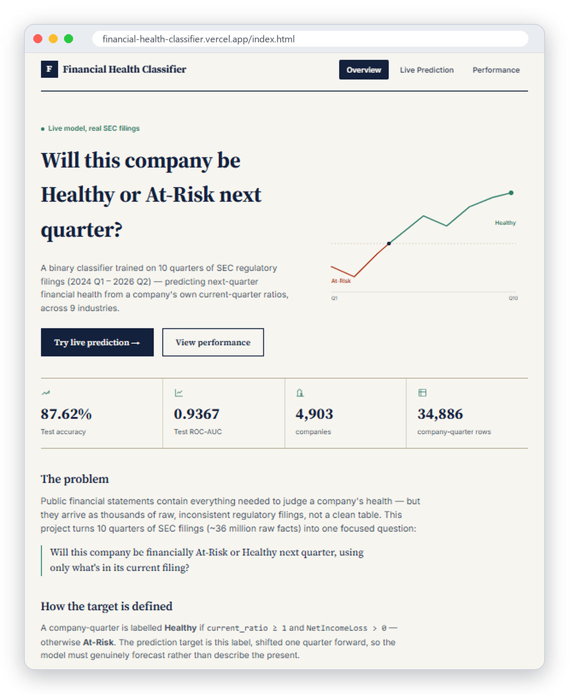
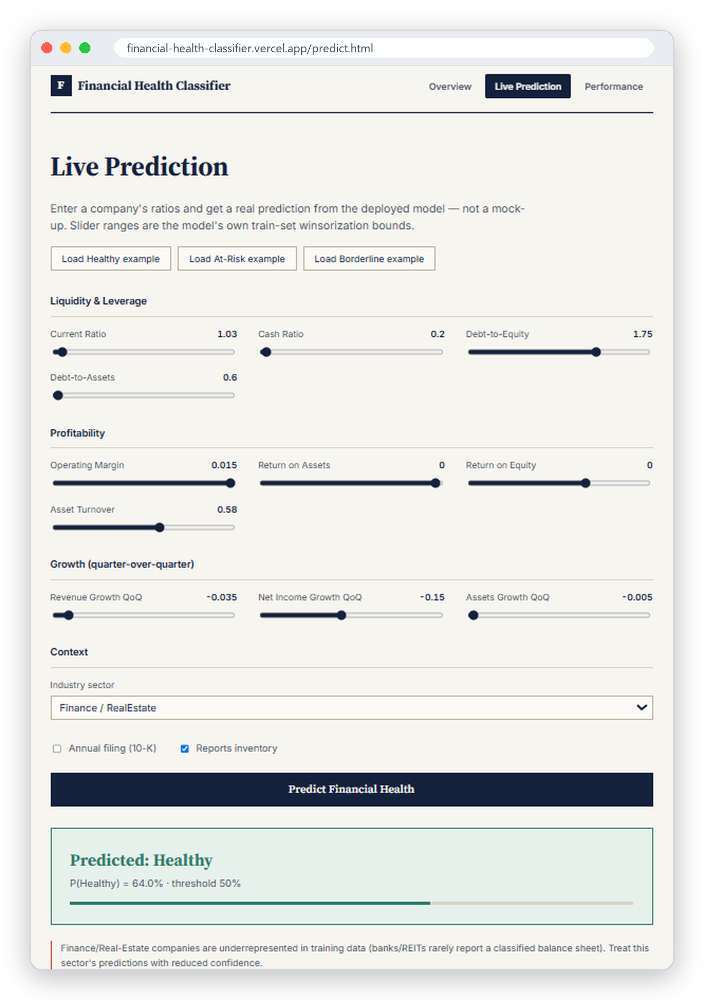
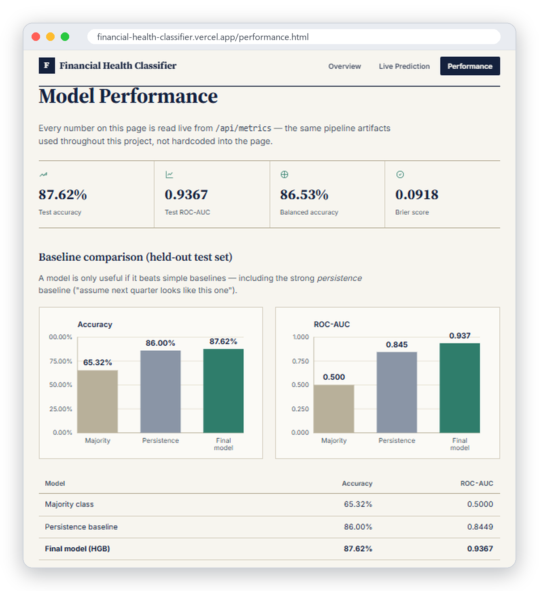
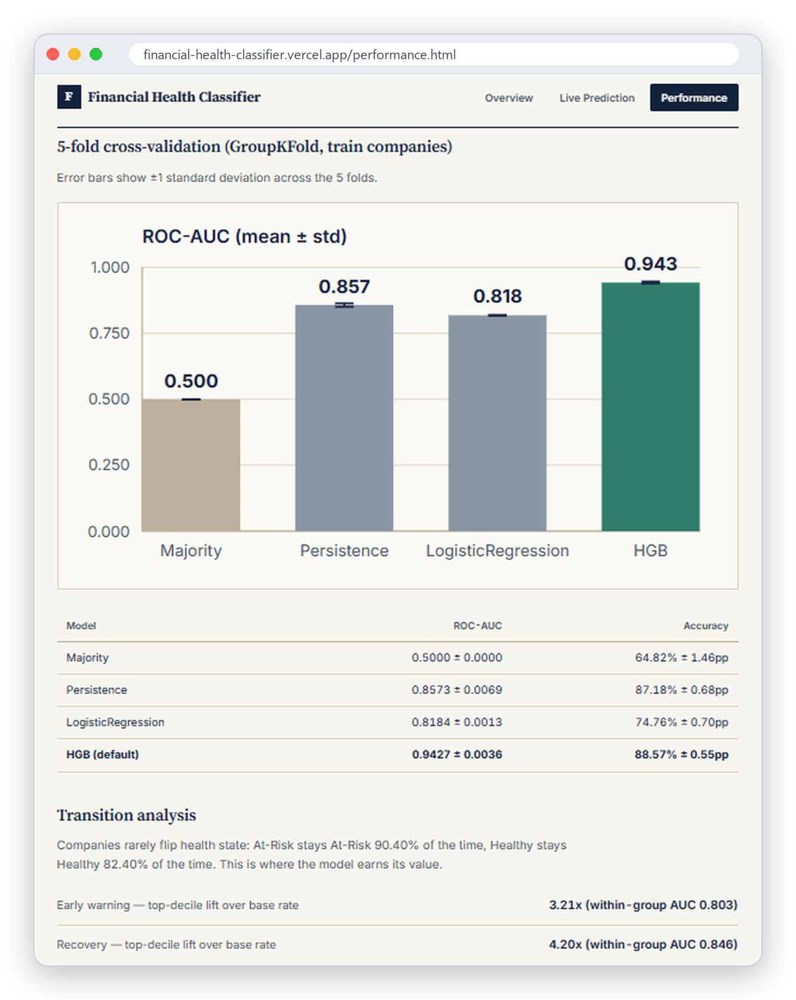

<h1 align="center">📈 Cross-Industry Corporate Financial Health Classifier</h1>

  Predicting whether a publicly-traded company will be <b>Healthy</b> or <b>At-Risk</b> next quarter — 
  built end-to-end on 10 quarters of raw SEC regulatory filings and deployed as a live web application.

  

---

## 📌 Overview

The **Cross-Industry Corporate Financial Health Classifier** converts 10 quarters (2024 Q1 – 2026 Q2) of raw SEC Financial Statement Data Sets — roughly 36 million individual regulatory facts covering 4,903 companies across 9 industry sectors — into one focused decision-support tool. Given a company's current-quarter financial ratios, the system predicts whether that company will be financially **Healthy** or **At-Risk** in the following quarter.

The project is a complete system rather than a notebook exercise. Data engineering, leakage-safe feature engineering, model training, statistical validation and a deployed interactive web application all work together as a single reproducible pipeline. Along the way, two hidden data-quality defects in the raw filings (currency contamination and annual/quarterly duration mixing) were diagnosed and fixed at their source before any model was trained.

| Metric (held-out test companies) | Value |
|---|---|
| Accuracy | **87.62%** |
| ROC-AUC | **0.9367** |
| Balanced Accuracy | 86.53% |
| 5-fold Grouped CV ROC-AUC | 0.9427 ± 0.0036 |

## 🎯 Aim

The aim of this project is to build a **trustworthy, transparent early-warning model for corporate financial health** that:

- uses only information genuinely available in a company's current filing, so every prediction is realistic and free of look-ahead leakage;
- is evaluated honestly against strong baselines (including a "next quarter looks like this one" persistence baseline), not just a majority-class comparison;
- explains *why* it makes its decisions, including how the target's own definition shapes feature importance;
- is accessible to non-technical users through a live, interactive web application.

## ✨ Features

- **End-to-end SEC data pipeline** — 13 reproducible stages that load, merge, pivot and clean raw `sub` / `num` / `tag` / `pre` filings into an analysis-ready company-quarter table.
- **Data-quality fixes at the source** — non-USD filers are filtered and 10-K annual figures are separated from 10-Q quarterly figures, removing a distortion that had inflated `asset_turnover` and `roa` by 3–4x.
- **11 financial ratios plus growth features** — liquidity, leverage, profitability, efficiency and quarter-over-quarter growth signals.
- **Leakage-safe validation** — a company-grouped train/test split is locked once and reused through outlier bounds, feature selection, tuning and final evaluation.
- **Evidence-based feature selection** — VIF, drop-one grouped cross-validation and grouped permutation importance, computed on training companies only.
- **Gradient-boosted classifier** — `HistGradientBoostingClassifier` with native missing-value handling, validated with 5-fold `GroupKFold`.
- **Live prediction API** — a lightweight FastAPI backend serving `/api/predict`, `/api/config` and `/api/metrics`.
- **Interactive web frontend** — Overview, Live Prediction (ratio sliders bounded by the model's own training ranges) and a Performance dashboard rendered live from the pipeline's real metrics.

## 🏗️ Architecture Diagram

```mermaid
flowchart LR
    A["SEC Financial Statement<br/>Data Sets (10 quarters)"] --> B["Load & Merge<br/>sub · num · tag · pre"]
    B --> C["Pivot & Clean<br/>currency + duration fixes"]
    C --> D["Outliers & EDA"]
    D --> E["Feature Engineering<br/>11 ratios + growth"]
    E --> F["Company-Grouped<br/>Train / Test Split"]
    F --> G["Feature Selection<br/>VIF + permutation"]
    G --> H["HistGradientBoosting<br/>Classifier"]
    H --> I["Validation<br/>GroupKFold CV + baselines"]
    I --> J[("Model Artifacts<br/>joblib + JSON")]
    J --> K["FastAPI Backend<br/>on Vercel"]
    K --> L["Web Frontend<br/>Overview · Prediction · Performance"]
```

## 🖼️ Screenshots

### Overview

### Live Prediction

### Model Performance

### Cross-Validation & Transition Analysis

## 💡 Benefits

- **Early warning for decision-makers** — investors, credit analysts and lenders can flag companies likely to slip into financial stress one quarter ahead.
- **Trustworthy results** — leakage-safe validation and honest baseline comparisons mean the reported performance reflects what the model can actually do on unseen companies.
- **Transparent reasoning** — feature importance is traced back to the target's definition, so users understand what drives each prediction instead of trusting a black box.
- **Cross-industry coverage** — one consistent model works across 9 sectors, with sector-level performance reported separately.
- **Instant, no-setup access** — anyone can test a scenario in the browser through the live demo, with no installation required.
- **Reusable foundation** — the cleaned SEC pipeline and its data-quality fixes can support further financial analytics projects.

## ✅ Conclusion

The Cross-Industry Corporate Financial Health Classifier shows a complete, evidence-driven approach to applied machine learning in finance. Instead of reporting whatever accuracy a model happens to produce, it identifies and fixes data-quality defects at their source, locks a leakage-safe validation methodology, explains the model's behaviour honestly and focuses the prediction on a question the data can genuinely support. The result — a held-out ROC-AUC of **0.9367**, backed by grouped cross-validation and served through a live application — is a defensible, deployment-ready financial health classifier.

  

