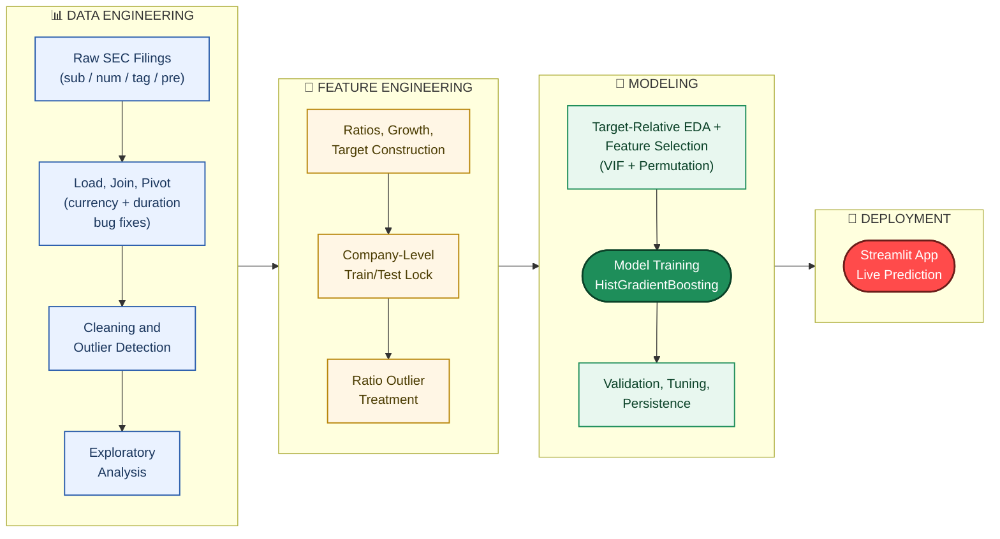

# 📈 Cross-Industry Corporate Financial Health Classifier

**A binary classification system that predicts whether a publicly-traded company will be Healthy or At-Risk next quarter — built end-to-end on 10 quarters of raw SEC regulatory filings, using only information genuinely available in the company's current filing.**

---

## Overview

The **Cross-Industry Corporate Financial Health Classifier** turns 10 quarters (2024 Q1 – 2026 Q2) of raw SEC Financial Statement Data Sets — ~36 million individual regulatory facts across 9 industry sectors — into a single, focused decision-support tool: predicting whether a company will be financially **Healthy** or **At-Risk** next quarter.

Unlike a typical modeling exercise that stops at reporting an accuracy number, this project's central contribution is a **rigorous root-cause investigation** into two data-quality bugs hidden inside the raw regulatory data, and the disciplined decision to drop a regression target once evidence showed it was learning a reporting-calendar artifact rather than real financial signal — rather than reporting an inflated metric.

The system is implemented as a complete, 13-stage end-to-end pipeline rather than a notebook exercise: data engineering, leakage-safe feature engineering, model training, statistical evaluation, and a deployed interactive Streamlit application are all implemented and working together.

## Problem Statement

Predicting corporate financial health from regulatory filings faces a recurring set of problems:

- **Raw filings silently mix reporting periods.** 10-K (annual) filings report income-statement figures as full-year totals while 10-Q (quarterly) filings report per-quarter — mixed without correction, this corrupts every ratio built from them and can masquerade as real "growth."
- **Foreign filers can contaminate a "USD" dataset.** Companies reporting in local currency (JPY, KRW, etc.) will silently distort raw dollar columns if not filtered before aggregation.
- **A naive train/test split leaks company identity.** Each company appears many times across quarters — a careless split lets the same company's data appear in both train and test, overstating real-world performance.
- **A model that looks strong can be riding a near-tautological signal without being technically wrong.** If the prediction target is itself defined from two ratios, a model that leans heavily on those same two ratios isn't cheating — but it needs to be explained honestly, not presented as a mysterious multivariate discovery.

What is needed is not just a model, but a transparently-diagnosed, defensible answer to *which* signal the data can actually support.

## Our Solution

The project addresses this through a disciplined, evidence-first workflow rather than iterative hyperparameter tuning:

1. **Diagnose before modeling.** A within-company ratio-consistency check (same company, annual vs. quarterly filings) revealed `asset_turnover`/`roa` differing by 3–4x between filing types — the signature of a duration-mixing bug, caught before any model was trained on it.
2. **Fix at the source, verify on synthetic and real data.** Both the currency-contamination and duration-mixing bugs were fixed inside the pivot stage, then stress-tested against synthetic raw files with deliberately injected edge cases, and cross-checked against real filings — zero cell-level discrepancies against ground truth.
3. **Reframe the target only where evidence demanded it.** A naive calendar-based baseline *beat* the original revenue-growth regression model on the (then-contaminated) data — proof the regression target was mostly learning the reporting-calendar artifact. Regression and clustering were dropped; the single classification target that survived scrutiny was kept.
4. **Lock a leakage-safe validation methodology.** A company-grouped `GroupShuffleSplit` (never a random row split) was locked once and reused unchanged through every later stage — winsorization bounds, feature selection, tuning, and final evaluation all respect it.
5. **Select features on evidence, not intuition.** VIF, drop-one grouped-CV, and grouped permutation importance were used to resolve redundancy and confirm relevance, run on train companies only.
6. **Explain honestly, including the target's own construction.** The target is built from `current_ratio` and `NetIncomeLoss` thresholds one quarter forward — which directly explains why those two features dominate permutation importance. This is documented, not hidden.
7. **Deploy it.** The final model, and every number reported about it, is served through a live multi-page Streamlit application rather than left in a notebook.

## System Architecture

### Diagrammatic Architecture

Each stage consumes the previous stage's saved artifact (parquet / JSON), so the pipeline runs reproducibly end-to-end — from raw filings to a served prediction — with no manual intervention between steps.

## Key Features

- **Root-cause diagnosis over blind tuning** — a within-company ratio-consistency check surfaced a duration-mixing bug before any model was trained on the corrupted signal.
- **Two independent bugs caught and fixed** — currency contamination and annual/quarterly duration mixing, both verified on synthetic edge-case data and real filings with zero cell-level discrepancies.
- **Leakage-safe validation methodology** — a company-grouped train/test split, locked once in feature engineering and reused unchanged through winsorization, feature selection, tuning, and final evaluation.
- **Evidence-driven target scope** — regression and clustering targets were dropped after a naive calendar baseline beat the regression model, proving it was learning an artifact rather than real signal.
- **Full transparency on target construction** — the target's own definition (`current_ratio ≥ 1` and `NetIncomeLoss > 0`, one quarter forward) is documented, directly explaining the model's feature-importance concentration rather than leaving it unexplained.
- **Statistical model evaluation** — baseline comparisons (majority class, persistence, logistic regression), calibration analysis, transition-probability analysis, and sector-level subgroup performance, beyond a single headline metric.
- **Reproducible, 13-stage pipeline** — every stage resolves its own file paths; sandbox-tested across multiple consecutive rounds for deterministic, bit-identical outputs.
- **Deployed interactive application** — a live multi-page Streamlit app serves real-time predictions with adjustable sliders, a full model-performance dashboard, feature-insight charts, and a documented limitations page, with every displayed number sourced directly from the pipeline's real artifacts.

## Limitations

- **Feature concentration in `current_ratio` and `roa`** — a direct, expected consequence of the target definition (see *Our Solution*, step 6), not a modeling flaw. The other 9 features provide only marginal refinement over this core persistence signal; a documented candidate for future work is a broader, multi-ratio composite target.
- **Sector under-representation** — Finance/Real-Estate companies are a small share of the trainable dataset, because banks/REITs don't report a classified balance sheet (`current_ratio` is structurally unavailable for many of them). Predictions for this sector should be treated with reduced confidence.
- **Small-sample subgroups** — some sectors (Agriculture, Construction, Wholesale) have well under 300 rows in the test set; their subgroup metrics are high-variance and shouldn't be over-interpreted as "best/worst sector" claims.
- **Point-in-time simplification** — outlier-treatment percentile bounds are computed once from train-company rows (not a strict walk-forward window); leakage-safe with respect to test companies, but not a fully rigorous rolling-time holdout.
- **Modest accuracy lift over the persistence baseline** — companies rarely flip health state quarter to quarter, so the model's edge is concentrated in ROC-AUC (ranking/probability quality) rather than raw accuracy; this is reported directly rather than only showing the more flattering majority-class comparison.

## Conclusion

The Cross-Industry Corporate Financial Health Classifier demonstrates a complete, evidence-driven approach to applied machine learning: rather than reporting whatever accuracy a model happens to produce, it investigates *why* two ratios dominate the model's decisions, identifies and fixes two distinct data-quality bugs at their source, locks a leakage-safe validation methodology, and reframes the prediction scope around what the data can honestly support. The result — a held-out test ROC-AUC of 0.9367 on a well-posed, transparently-explained binary question, backed by statistical evaluation, baseline comparisons, and a deployed live application — is a defensible, deployment-ready system, which is the standard a genuinely trustworthy predictive model needs to meet.
